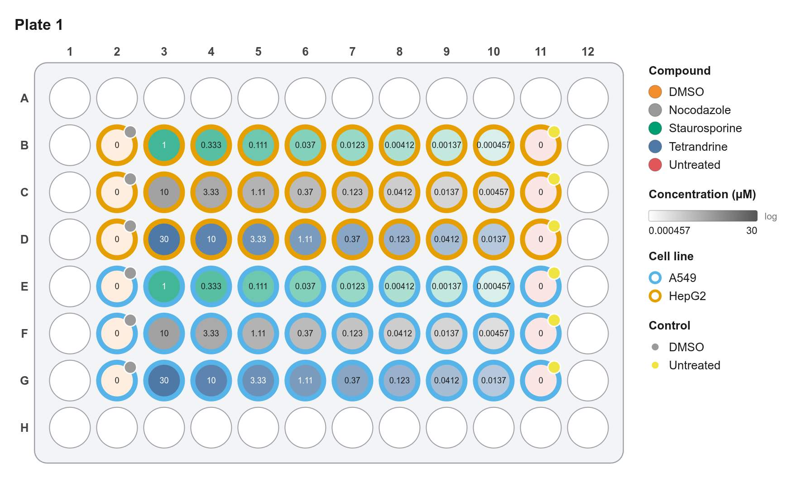
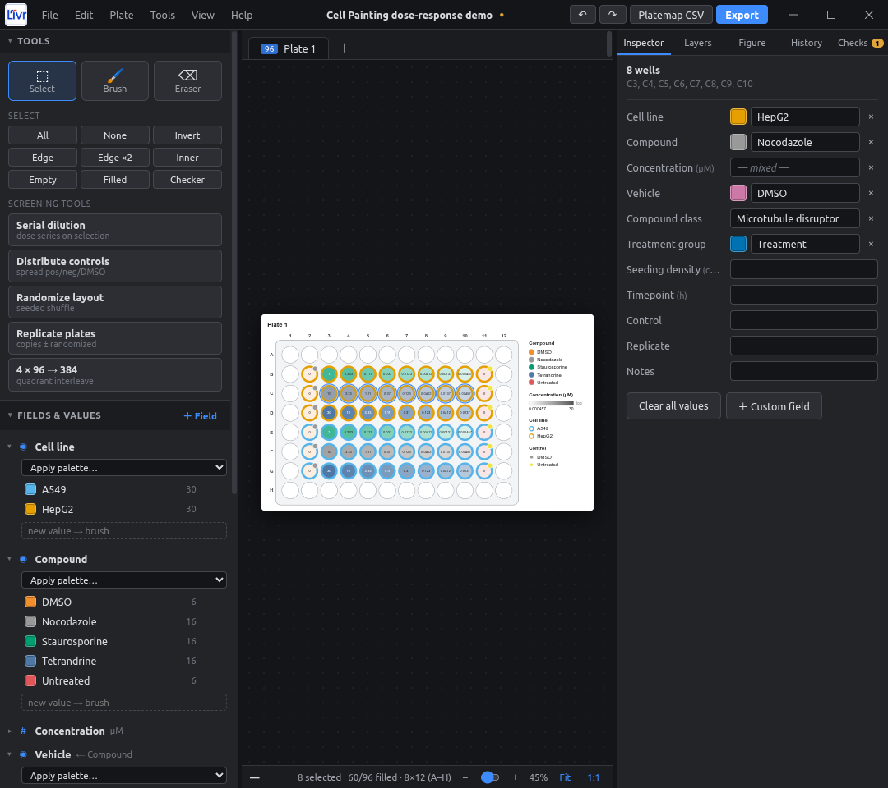
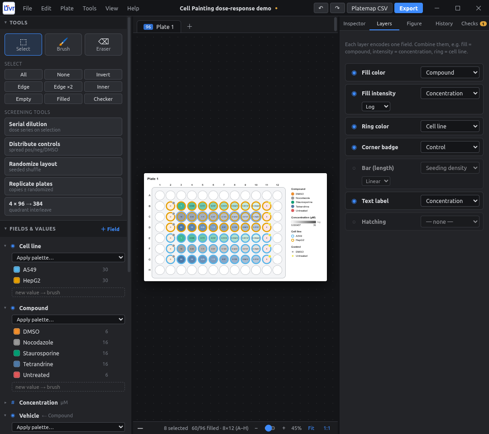
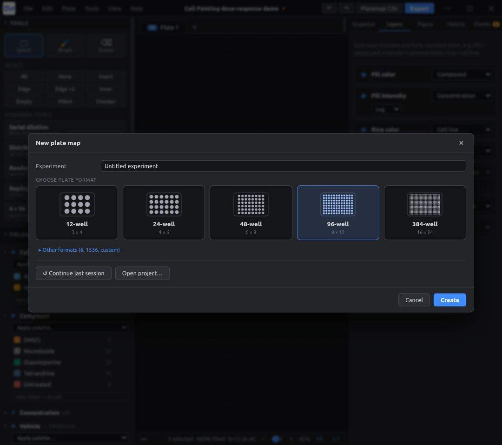
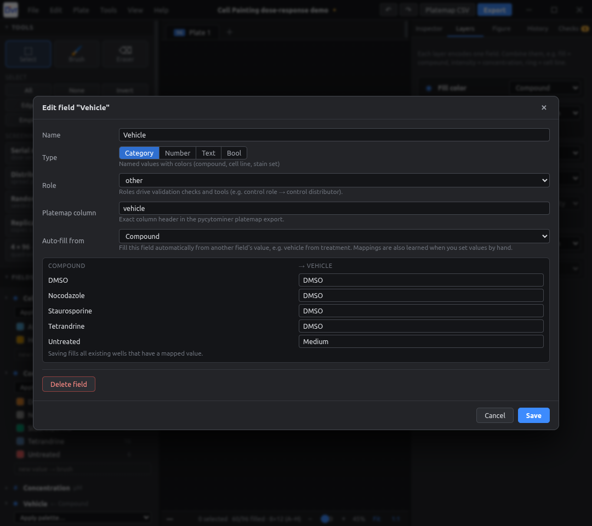
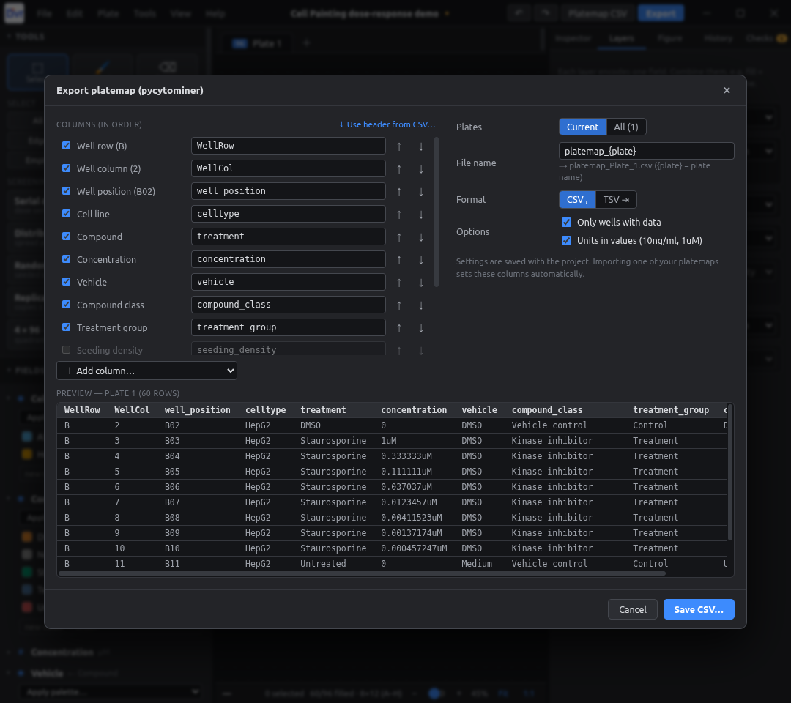
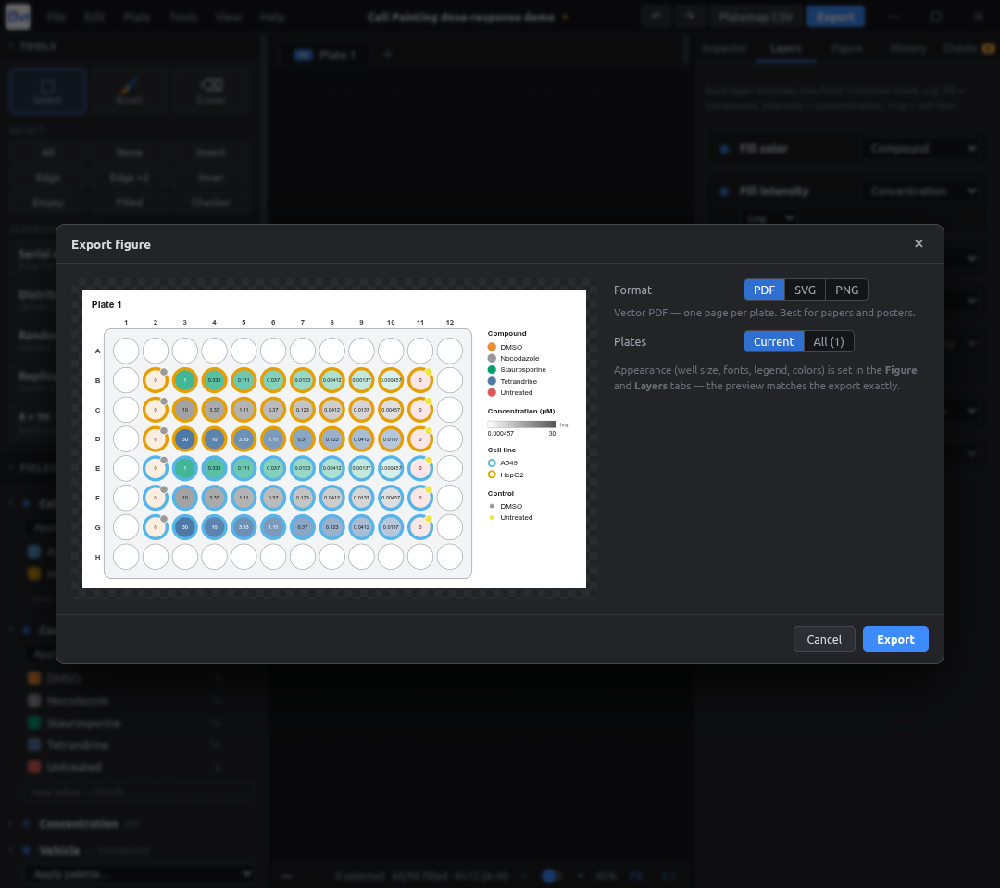

<p align="center">
  
</p>

<h1 align="center">PlateMap Studio</h1>

<p align="center">
  A desktop plate-map designer for high-content screening and Cell Painting.<br>
  Design layouts, keep every edit undoable, and export publication figures and pycytominer-ready platemaps.
</p>

<p align="center">
  <a href="https://github.com/LIVR-VUB/Platemap-studio/actions/workflows/release.yml"></a>
  <a href="https://github.com/LIVR-VUB/Platemap-studio/releases/latest"></a>
  <a href="https://github.com/LIVR-VUB/Platemap-studio/releases"></a>
  <a href="LICENSE"></a>
  
  
</p>

<p align="center">
  <a href="#download"></a>
  <a href="#download"></a>
  <a href="#download"></a>
  <a href="#download"></a>
  <a href="#download"></a>
</p>

<p align="center">
  
  
  
  
  
  
  
  
  
</p>

<p align="center">
  
</p>

---

## Why

Plate maps usually live in spreadsheets or one-off scripts. Fixing one mistake means rebuilding the layout, and metadata such as the vehicle for each compound gets patched in by hand afterwards. PlateMap Studio treats the plate map as a document. You edit it directly on the plate, every change can be undone, and the same layout produces the figure for the paper and the platemap CSV for the analysis pipeline.

## Features

**Editing**
- Plate formats: 6, 12, 24, 48, 96, 384 and 1536 wells, plus custom rows × columns. The start screen asks for the format before anything else.
- Several plates in one project, shown as tabs. Duplicate, reorder, resize or delete plates.
- Selection works like Excel or Photoshop: box-drag, Shift to add, Ctrl to toggle, click or drag row and column headers, and quick selects (edge, inner, empty, checkerboard, invert).
- Inspector panel to edit the selected wells, a Brush to paint a value, an Eraser, and copy/paste of wells.
- **Unlimited undo/redo and a History panel.** Click any earlier step to go back to it.
- Autosave after every edit. Projects save as `.platemap` (JSON).

**Metadata**
- Built-in fields: cell line, compound/treatment, concentration, vehicle, compound class, treatment group, seeding density, timepoint, control type, replicate and notes.
- **Custom fields** of type category (with colors), number (with unit), text or yes/no.
- **Per-well units**: type `10ng/ml` or `1uM` straight into a concentration cell. One plate can mix units.
- **Auto-fill fields**: vehicle, compound class and treatment group follow the treatment. Set them once for a compound and every other well with that compound gets the same values. The mappings can be edited in the field settings.

**Visual design**
- Layers show several fields at once: fill color, fill intensity (log or linear), ring color, corner badge, bar, text label and hatching.
- A color picker like the ones in Photoshop and Lightroom: HSV square, hue slider, hex/RGB entry, eyedropper, recent colors and colorblind-safe palettes (Okabe-Ito, Tol, viridis, cividis…).
- Adjustable well shape, size, spacing, fonts, legend position and colors. The canvas zooms and the side panels resize.

**Screening tools**
- **Serial dilution**: each selected row or column becomes one series. Set the top dose, dilution factor and direction; the last point can be the vehicle (0).
- **Distribute controls**: spreads positive, negative and vehicle controls evenly across rows and columns, or places them at random with a seed.
- **Randomize layout**: a seeded shuffle, so any layout can be reproduced. It can keep controls fixed or shuffle only chosen fields.
- **Replicate plates**: makes copies of a plate, each optionally randomized with its own seed.
- **4 × 96 → 384**: standard quadrant interleave that records the source plate and well.
- **Checks**: missing or clustered controls, dose without compound, treatments on edge wells, missing cell line, unknown vehicle for a compound, and duplicate plate names.

**Export**
- Figures: vector **PDF** (one page per plate), vector **SVG**, and **PNG** at 150–1200 dpi with the DPI written into the file.
- **pycytominer platemaps** with exact column names (see below), one file per plate, plus `barcode_platemap.csv`.
- A long-format CSV of every well.
- Import of existing platemap CSV/TSV files. These re-export unchanged.

## Screenshots

| Editor | Layers |
|---|---|
|  |  |
| **Start screen: pick the plate format** | **Auto-fill vehicle from treatment** |
|  |  |
| **pycytominer platemap export** | **Figure export (PDF / SVG / PNG)** |
|  |  |

## Download

Ready-to-run installers are on the **[Releases page](https://github.com/LIVR-VUB/Platemap-studio/releases/latest)**:

| OS | File | Notes |
|---|---|---|
| **Windows** 10/11 | `…-windows-setup.exe` (installer) or `…-windows-portable.exe` (no install) | The app is not code-signed, so SmartScreen may warn: click *More info → Run anyway*. |
| **macOS** (Apple Silicon M1–M4) | `…-mac-arm64.dmg` | Not notarized. Open the DMG and drag the app to Applications. The first time, **right-click the app → Open → Open**. If macOS says it is "damaged", run `xattr -cr "/Applications/PlateMap Studio.app"` |
| **macOS** (Intel) | `…-mac-x64.dmg` | Same as above |
| **Ubuntu / Debian** | `…-linux-amd64.deb` | `sudo apt install ./PlateMap-Studio-*-linux-amd64.deb`, then launch it from the app menu |
| **Any Linux** | `…-linux-x86_64.AppImage` | `chmod +x PlateMap-Studio-*.AppImage && ./PlateMap-Studio-*.AppImage`. On Ubuntu 24.04+, use the `.deb` or add `--no-sandbox`. Needs `libfuse2` (`sudo apt install libfuse2`) |

Double-clicking a `.platemap` project file opens it in the app once it is installed.

### Making a new release

Bump `version` in `package.json`, then tag and push:

```bash
git tag v0.2.0 && git push origin v0.2.0
```

GitHub Actions ([`.github/workflows/release.yml`](.github/workflows/release.yml)) builds on Linux, Windows and macOS and publishes the installers on a new release. Build locally with `npm run dist:linux`, `npm run dist:win` or `npm run dist:mac`. Each OS can only build its own installers reliably; macOS installers can only be built on a Mac.

## Build from source

You need [Node.js](https://nodejs.org/) 20 or newer.

```bash
git clone https://github.com/LIVR-VUB/Platemap-studio.git
cd Platemap-studio
npm install
npm start          # builds and opens the desktop app
```

Other scripts:

| Command | What it does |
|---|---|
| `npm run dev` | Development mode with hot reload (Vite + Electron) |
| `npm run web` | Browser-only mode at http://localhost:5173 (no PDF export or folder writing) |
| `npm run build` | Type-check and build into `dist/` |
| `npm run dist` | Package installers for the current OS into `release/` |

## Quick start

1. **Pick a format** on the start screen (for example 96-well) and name the experiment.
2. **Select wells**: drag over B2–G2, or click a row letter or column number.
3. **Type values** in the Inspector on the right: cell line, compound, concentration (`10ng/ml`, `1uM`, …). Press Enter to apply.
4. For a dose series, select the wells and run **Serial dilution**.
5. Set the vehicle, compound class and treatment group **once per compound**. Later wells with that compound fill in automatically.
6. Check the **Checks** tab for missing controls or unknown vehicles.
7. Use **Export** for the figure and **Platemap CSV** for pycytominer.

Made a mistake? Press Ctrl+Z, or open the **History** tab and click the step you want to go back to.

## pycytominer platemap format

The default export follows this layout:

```csv
WellRow,WellCol,well_position,celltype,treatment,concentration,vehicle,compound_class,treatment_group
B,2,B02,HepG2,DMSO,0,DMSO,Vehicle control,Control
B,3,B03,HepG2,Staurosporine,1uM,DMSO,Kinase inhibitor,Treatment
B,4,B04,HepG2,TGF,10ng/ml,DMEM,Cytokine stimulation,Treatment
```

- **Column names and order** are editable in the export dialog. **Use header from CSV…** copies them exactly from an existing platemap. New projects remember that layout.
- **All plates**: choose a folder and get `platemap_<plate>.csv` for each plate plus `barcode_platemap.csv`:
  ```csv
  Assay_Plate_Barcode,Plate_Map_Name
  Plate_3_analysis,platemap_plate3
  ```
  Set each plate's barcode in *Plate settings* (double-click the plate tab). It defaults to the plate name.
- **Units** are written inline (`10ng/ml`, `1uM`, a plain `0` for vehicle). This can be switched off.
- **Importing** a platemap (File → Import) recreates the plate (`platemap_plate3.csv` becomes the plate `plate3`), learns the vehicle and class mappings, and uses its header as the export template.

## Keyboard shortcuts

| Keys | Action |
|---|---|
| `V` / `B` / `E` | Select / Brush / Eraser |
| `Ctrl+Z` / `Ctrl+Shift+Z` | Undo / Redo |
| `Ctrl+C` / `Ctrl+V` | Copy / paste wells |
| `Ctrl+A` / `Ctrl+D` / `Esc` | Select all / deselect |
| `Delete` | Clear selected wells |
| `Ctrl+N` / `Ctrl+O` / `Ctrl+S` | New / open / save project |
| `Ctrl+E` | Export figure |
| `Ctrl+Shift+E` | Export platemap CSV |
| `Ctrl + mouse wheel`, `Ctrl+=` / `Ctrl+-`, `Ctrl+1` | Zoom, actual size |

## Project structure

```
electron/             Electron main process: frameless window, file dialogs, vector PDF rendering
src/
  model.ts            Document model: plates, fields, layers, colors, units, seeded RNG
  store.ts            State and undo history (immer snapshots), edits, screening algorithms, auto-fill
  platemap.ts         pycytominer platemap tables, header templates, barcode_platemap
  io.ts               Project files, figure export (SVG/PNG/PDF), CSV import/export
  components/
    PlateFigure.tsx   SVG renderer shared by the canvas and every export
    Canvas.tsx        Interactive canvas: hit-testing, selection, brush, zoom, plate tabs
    Panels.tsx        Tools, fields, inspector, layers, figure style, history, checks
    Dialogs.tsx       Start screen, wizards, field editor, export dialogs
    ColorPicker.tsx   HSV color picker
```

**Tech:** Electron, React 19, TypeScript, Vite, immer. One SVG renderer draws both the screen and every export, so the exported files match what you see on screen.

## Roadmap

- Echo / liquid-handler picklists (needs source-plate volumes)
- Native Excel (.xlsx) export
- Library of reusable plate templates
- Code-signed Windows and notarized macOS builds

## Contributing

Issues and pull requests are welcome. Before opening a PR, run `npm run build`; it must pass the type-check.

## License

[MIT](LICENSE) © 2026 LIVR-VUB (Vrije Universiteit Brussel)

---

<p align="center">Developed at LIVR · Vrije Universiteit Brussel</p>
