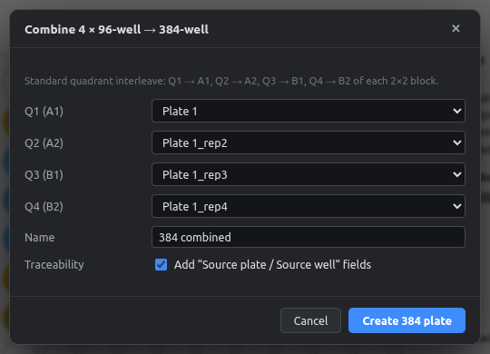
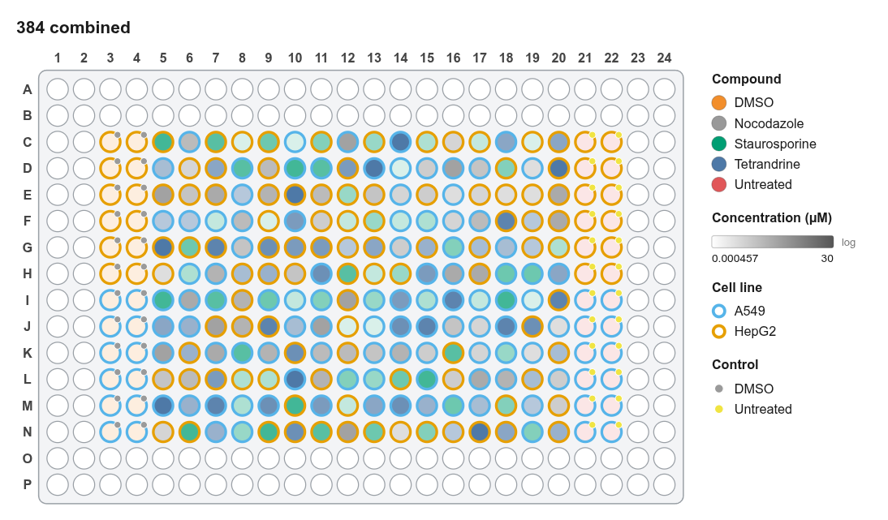

# 4 × 96 → 384

Combines four 96-well plates into one 384-well plate using the standard **quadrant interleave**, as done by 384-channel pipetting heads and acoustic dispensers.

| Source | Goes to (in each 2 × 2 block) |
|---|---|
| Q1 | top-left (A1, A3, … C1, …) |
| Q2 | top-right (A2, A4, …) |
| Q3 | bottom-left (B1, B3, …) |
| Q4 | bottom-right (B2, B4, …) |

So well **B2 of Q1** lands in **C3** of the 384-well plate.

<figure markdown="span">
  { .shot width="560" }
</figure>

1. Make or import the four 96-well plates.
2. **Tools → Combine 4 × 96 → 384…**
3. Choose a plate for each quadrant (leave one empty if you have fewer than four), name the new plate, and click **Create 384 plate**.

**Traceability** adds two fields, **Source plate** and **Source well**, so every 384 well records where it came from. These also appear in the platemap export.

<figure markdown="span">
  { .shot width="720" }
  <figcaption>Four replicate 96-well plates combined into a 384-well plate.</figcaption>
</figure>
