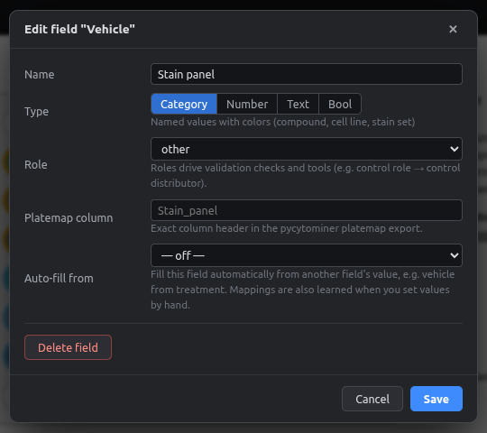

# Auto-fill fields

Some metadata follows directly from another field: the **vehicle** depends on the compound, and so do the **compound class** and **treatment group**. Instead of typing them for every well, or fixing them afterwards with a script, let them fill in automatically.

## How it works

1. Set the compound on a well, e.g. *JQ1*.
2. Set its vehicle once, e.g. *DMSO*. The app learns **JQ1 → DMSO**.
3. Every other well that gets *JQ1*, now or later, gets *DMSO* automatically.

The built-in **Vehicle**, **Compound class** and **Treatment group** fields already auto-fill from **Compound**. The ← *Compound* tag next to them in the Fields panel shows this.

## Viewing and editing the mappings

Open the field settings (⚙ next to *Vehicle*):

<figure markdown="span">
  { .shot width="600" }
  <figcaption>The mapping table: one row per compound. Fill in any empty rows and click <b>Save</b> to apply them to every existing well.</figcaption>
</figure>

- **Auto-fill from** can be any category field. Set it to *— off —* to turn auto-fill off.
- Mappings are learned from values you enter by hand **and** from imported platemaps.
- To make any custom field auto-fill (e.g. *Supplier* from *Compound*, or *Passage* from *Cell line*), set **Auto-fill from** when you create it.

## What happens when things change

| Situation | Result |
|---|---|
| You change a well's compound to one **with** a mapping | Vehicle, class and group update |
| You change it to one **without** a mapping | Auto-filled values that belonged to the old compound are removed, so nothing stale is left behind |
| You type a vehicle by hand | Your value is used and the mapping is updated |
| You randomize only the compound | Auto-filled fields move with it |
| A compound has no mapping yet | **Checks** shows *"Vehicle unknown for Compound: …"* |

!!! example "Replaces a post-processing script"
    Instead of keeping a `TREATMENT_TO_VEHICLE` dictionary in Python and patching CSVs after export, the mapping lives in the project. The exported platemap already has the vehicle column filled in.
