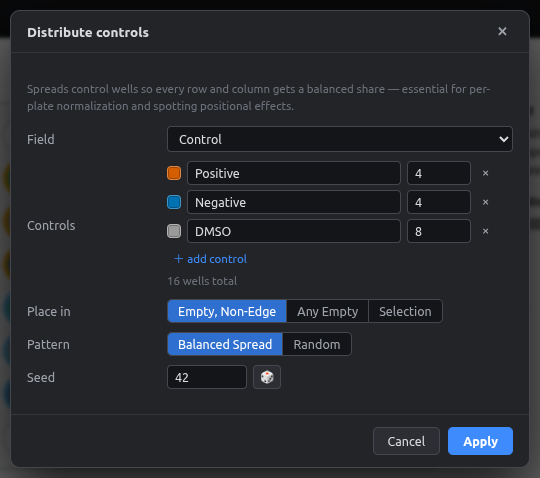
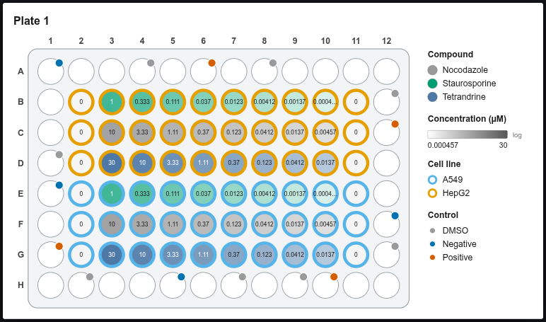

# Distributing controls

Putting all controls in one column makes plate effects (edge evaporation, temperature or dispense gradients) look like biology. **Distribute controls** spreads them so every row and column gets a balanced share.

<figure markdown="span">
  { .shot width="560" }
</figure>

| Option | Meaning |
|---|---|
| **Field** | Category field to write to (default: Control) |
| **Controls** | Each control value and how many wells it needs. **＋ add control** for more |
| **Place in** | *Empty, non-edge* (recommended), *Any empty*, or the current *Selection* |
| **Pattern** | *Balanced spread*: even across rows/columns and far apart. *Random*: random placement with a seed |
| **Seed** | Same seed → same placement. 🎲 picks a new one |

<figure markdown="span">
  { .shot width="680" }
  <figcaption>4 Positive, 4 Negative and 8 DMSO controls spread over the empty wells (badges in the well corners). The placed wells stay selected, so you can give them a compound or concentration right away.</figcaption>
</figure>

## How the balanced spread works

Controls are placed one at a time, alternating between control types. Each goes in the candidate well that:

1. sits in the row and column with the **fewest controls so far**, then
2. is **farthest from controls of the same type**, then
3. is farthest from any control.

The result is close to a Latin-square layout, which is what plate-normalization methods (per-plate z-scores, B-score, pycytominer `normalize`) work best with.

!!! tip
    If there aren't enough candidate wells, the dialog tells you how many it needs. Free some wells or choose *Any empty*.
