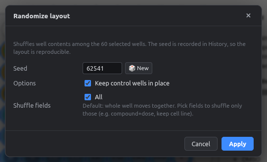
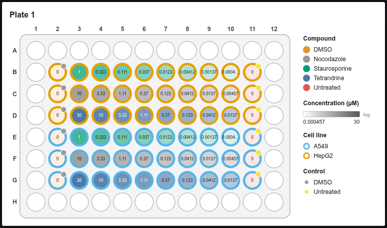
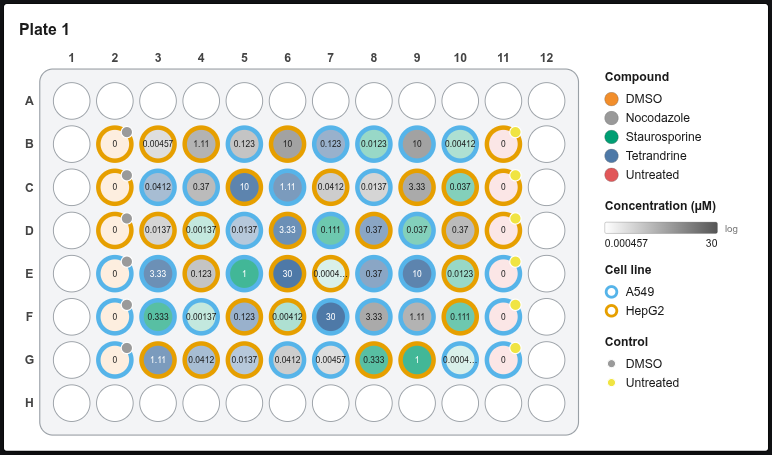

# Randomizing layouts

Randomization breaks the link between *what* is in a well and *where* it is, so plate position can't masquerade as a treatment effect.

## Step by step

1. Select the wells to shuffle. Usually **Inner**, so the edge wells stay as buffer.
2. **Randomize layout** (left panel) or **Tools → Randomize layout…**.

<figure markdown="span">
  { .shot width="560" }
</figure>

| Option | Meaning |
|---|---|
| **Seed** | Same seed + same starting layout → same result. Recorded in the History step name |
| **Keep control wells in place** | Controls stay put; only treatments move |
| **Shuffle fields** | *All*: whole wells move. Or tick only some fields, e.g. shuffle compound + concentration but keep the cell line per row |

<figure markdown="span">
  { .shot }
  <figcaption>Before: ordered dilution series.</figcaption>
</figure>

<figure markdown="span">
  { .shot }
  <figcaption>After: shuffled within the inner wells; controls (columns 2 and 11) kept.</figcaption>
</figure>

!!! success "Auto-filled fields travel along"
    When you shuffle only *Compound*, its vehicle, class and treatment group move with it, so a well never ends up with the wrong vehicle.

!!! note "Reproducibility"
    Write the seed in your methods section. With the same plate layout and seed, the app gives exactly the same randomization on any computer.
