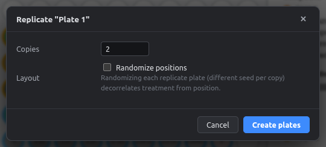
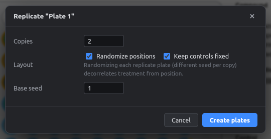

# Replicate plates

Make copies of a plate, optionally with a different randomized layout on each copy. This is the standard way to make biological replicates position-independent.

Right-click a plate tab → **Replicate / randomize…**, or click **Replicate plates** in the left panel.

<figure markdown="span">
  { .shot }
  <figcaption>Plain copies.</figcaption>
</figure>

<figure markdown="span">
  { .shot }
  <figcaption>Each copy randomized with its own seed.</figcaption>
</figure>

| Option | Meaning |
|---|---|
| **Copies** | How many new plates (1–50) |
| **Randomize positions** | Shuffle each copy. Copy *n* uses seed *base + n* |
| **Keep controls fixed** | Controls stay in the same wells on every replicate |
| **Base seed** | Starting seed, for reproducibility |

Copies are named `<plate>_rep2`, `<plate>_rep3`, …

{ .shot }

Only filled wells are shuffled, so empty and edge wells stay empty. See the worked example [Randomized replicate plates](../examples/randomized-replicates.md).
