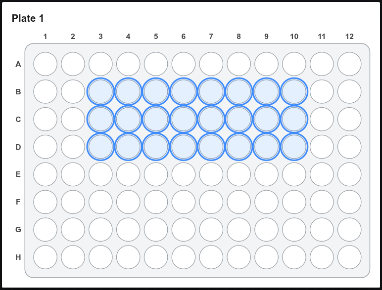
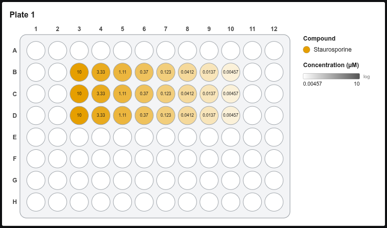

# Serial dilution

Fills the selected wells with a dilution series. **Each selected row (or column) becomes one series**, so selecting 3 rows × 8 columns gives 3 replicate series of 8 points.

## Step by step

1. Select the wells, e.g. B3–D10.

    { .shot width="560" }

2. Click **Serial dilution** (left panel) or **Tools → Serial dilution…**.

    { .shot width="560" }

3. Fill in the dialog:

    | Option | Meaning |
    |---|---|
    | **Field** | Which number field to fill (usually Concentration) |
    | **Top dose + unit** | Highest concentration and its unit (nM, µM, ng/ml, …) |
    | **Dilution factor** | 1 : *x*. Quick buttons for 2, 3, 10 and √2 (half-log) |
    | **Direction** | *Across rows →*: each row is a series. *Down columns ↓*: each column is a series |
    | **High → low** | Untick to start with the lowest dose |
    | **Last point = 0 (vehicle)** | Makes the last well of each series a vehicle control |
    | **Also set** | Optionally give the same wells a compound in one go |

4. Check the **preview** at the bottom, then click **Apply**.

<figure markdown="span">
  { .shot width="680" }
  <figcaption>Three replicate series of Staurosporine, 10 µM → 4.57 nM (1:3), labelled with the concentration layer.</figcaption>
</figure>

!!! tip "Different compounds per row"
    Run the wizard once per row with a different **Also set** compound, or run it once on all rows and then change the compound per row in the Inspector.

!!! info "Precision"
    Values are kept to 6 significant digits (e.g. 0.333333). Exports write them without rounding artifacts.
