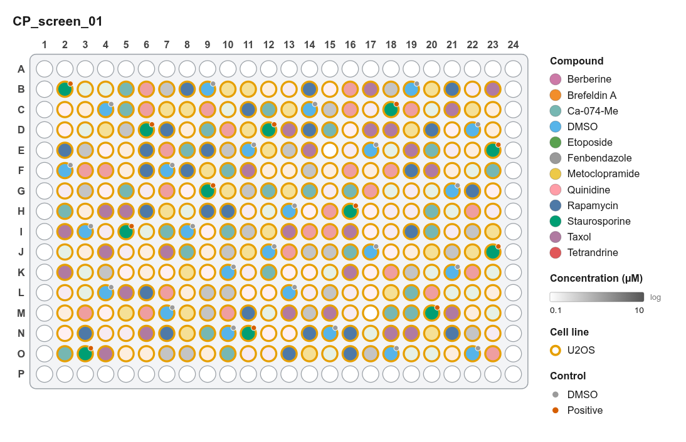
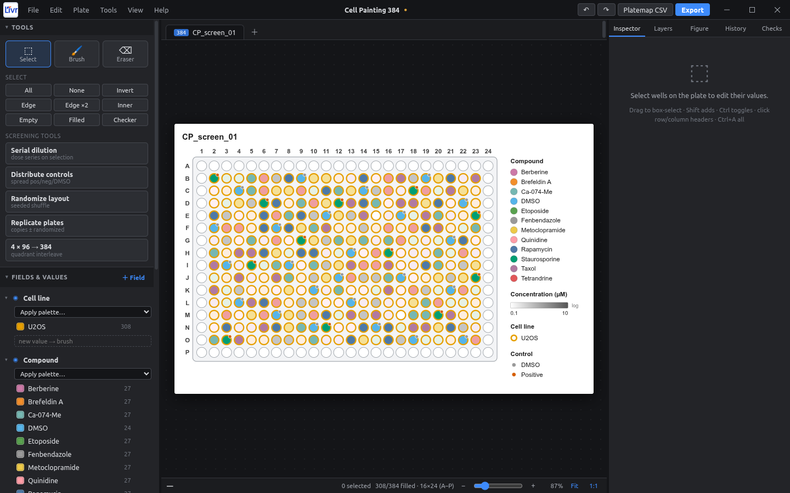

# 384-well Cell Painting screen

**Goal:** profile 10 reference compounds at 3 doses in U2OS cells on a 384-well plate. Controls are spread across the plate, positions are randomized, and the metadata goes straight to pycytominer.

<figure markdown="span">
  { .shot }
  <figcaption>24 DMSO and 12 positive-control (Staurosporine) wells spread evenly; compounds randomized; outer ring kept empty.</figcaption>
</figure>

## Steps

1. **New project → 384-well.** Name the plate `CP_screen_01` (double-click the tab).
2. **Controls first:** **Distribute controls** with *DMSO × 24*, *Positive × 12*, *Place in: Empty, non-edge*, *Balanced spread*, seed `7`. The placed wells stay selected; give the DMSO ones *Compound* `DMSO` and the positive ones `Staurosporine`.
3. **Cell line:** click **Inner**, then set *Cell line* = `U2OS`.
4. **Compounds:** select blocks of empty inner wells and set compound and dose, or import them from a compound-library CSV (**File → Import**).
5. **Randomize:** select **Inner**, then **Randomize layout** with *Keep control wells in place* and seed `2026`.
6. **Auto-fill:** set the vehicle and compound class once per compound; every well follows.
7. **Barcode:** in Plate settings, set *Barcode* to the plate barcode your imager writes (e.g. `BR00123456`).
8. **Export:** **Platemap CSV** → *All plates*, *One per plate*, *Also write barcode_platemap* → choose your project's `metadata/` folder.

<figure markdown="span">
  { .shot }
</figure>

## Using it in pycytominer

```python
import pandas as pd
from pycytominer import annotate

platemap = pd.read_csv("metadata/platemap_CP_screen_01.csv")
profiles = pd.read_csv("profiles/CP_screen_01.csv")

annotated = annotate(
    profiles=profiles,
    platemap=platemap,
    join_on=["Metadata_well_position", "Metadata_Well"],
)
```

!!! tip "Column names"
    Some pipelines expect a `Metadata_` prefix. Rename the headers once in the export dialog (e.g. `treatment` → `Metadata_treatment`). New projects keep that layout.
