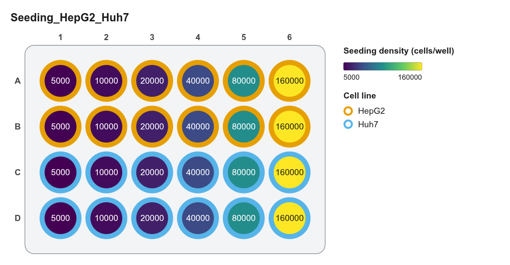
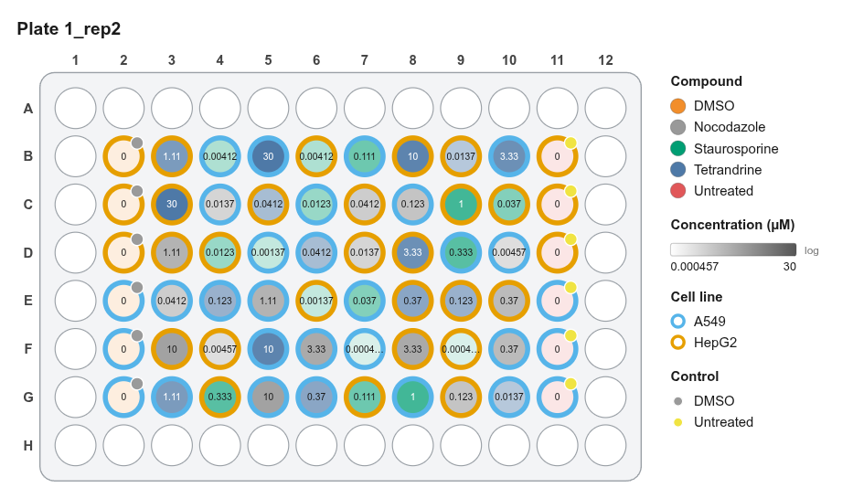
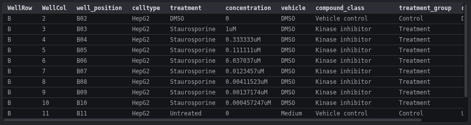

# Examples

Worked use cases from start to finish. Each lists the steps, the settings used, and the result.

-   **[Dose-response in two cell lines](dose-response.md)**

    ---

    { .no-zoom }

    96-well · serial dilutions · controls per row

-   **[384-well Cell Painting screen](cell-painting-384.md)**

    ---

    { .no-zoom }

    384-well · spread controls · randomized · pycytominer export

-   **[Seeding density optimisation](seeding-optimisation.md)**

    ---

    { .no-zoom }

    24-well · density gradient · color ramp

-   **[Randomized replicate plates](randomized-replicates.md)**

    ---

    { .no-zoom }

    3 plates · seeded randomization · barcodes

-   **[Cytokines and drugs, mixed units](mixed-units.md)**

    ---

    { .no-zoom }

    ng/ml + nM + % v/v on one plate

-   **[Bringing in existing platemaps](existing-platemaps.md)**

    ---

    { .no-zoom }

    Import CSVs · learn vehicles · re-export unchanged

