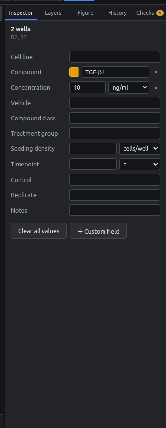

# Cytokines and drugs, mixed units

**Goal:** a stimulation experiment where the cytokine is dosed by mass (ng/ml), small molecules by molarity (nM), and the solvent control by volume (% v/v), all on one plate and in one *concentration* column.

<figure markdown="span">
  { .shot }
</figure>

## Steps

1. Select B2:B3 → *Compound* `TGF-β1`; *Concentration* `10` with unit **ng/ml** from the dropdown.
2. Select B4:B5 → `JQ1`, `500` **nM**.
3. Select B6:B7 → `Ethanol`, `0.1` **% v/v**.

<div class="side-by-side" markdown>

{ .shot }

{ .shot }

</div>

The platemap export writes each value with its own unit:

```csv
well_position,treatment,concentration
B02,TGF-β1,10ng/ml
B04,JQ1,500nM
B06,Ethanol,0.1%v/v
```

!!! tip
    Typing works too: `10ng/ml`, `500 nM` or `0.1 % v/v` straight into the concentration box.
