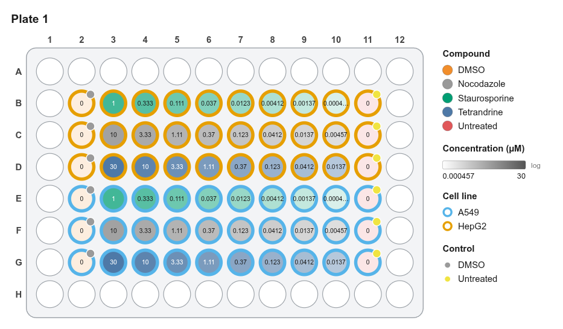
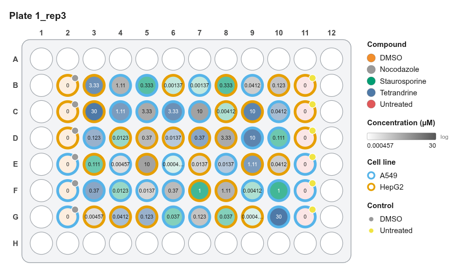

# Randomized replicate plates

**Goal:** three biological replicate plates with the same treatments in a different random arrangement on each, so plate position can't create a fake effect. Controls stay in fixed columns for easy QC.

<figure markdown="span">
  { .shot }
  <figcaption>Replicate 1: original layout.</figcaption>
</figure>

<figure markdown="span">
  { .shot }
  <figcaption>Replicate 2: randomized (seed 43).</figcaption>
</figure>

<figure markdown="span">
  { .shot }
  <figcaption>Replicate 3: randomized (seed 44).</figcaption>
</figure>

## Steps

1. Design plate 1 (see [Dose-response](dose-response.md)).
2. Right-click its tab → **Replicate / randomize…**
3. *Copies* `2`, tick **Randomize positions** and **Keep controls fixed**, *Base seed* `42`.
4. Two new tabs appear: `Plate 1_rep2` (seed 43) and `Plate 1_rep3` (seed 44).
5. Set each plate's **barcode** (double-click the tab).
6. **Platemap CSV → All plates** writes three platemaps plus `barcode_platemap.csv`.

!!! note "For the methods section"
    *"Treatment positions were randomized per replicate plate with PlateMap Studio (seeded shuffle, seeds 43–44), keeping control columns fixed."* The seeds are also listed in the History panel.
