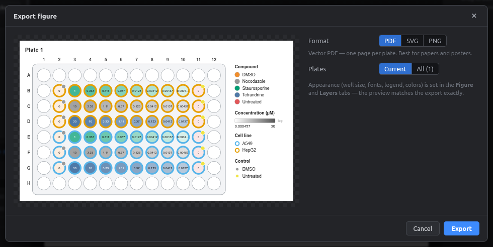

# Your first plate map

In this 10-minute walkthrough you'll build a 96-well dose-response plate:

- **Two cell lines:** HepG2 in rows B–D, A549 in rows E–G.
- **Three compounds**, each as an 8-point 1:3 dilution.
- **Controls** in columns 2 and 11.

Then you'll export a figure and a platemap CSV.

<figure markdown="span">
  { .shot width="760" }
  <figcaption>What you'll have at the end.</figcaption>
</figure>

## 1. Choose the plate format

When the app starts, the **New plate map** screen appears. Type an experiment name, pick **96-well**, and click **Create**.

<figure markdown="span">
  { .shot width="700" }
</figure>

!!! info "Opening this screen later"
    **File → New project…** (++ctrl+n++) brings this screen back.

## 2. Add the cell lines

1. Select rows **B–D, columns 2–11**: press the mouse on well B2 and drag to D11.
2. In the **Inspector** on the right, type `HepG2` in **Cell line** and press ++enter++.
3. Select **E2–G11** and enter `A549` the same way.

<figure markdown="span">
  { .shot }
  <figcaption>Drag to box-select. A dashed rectangle shows the area.</figcaption>
</figure>

<figure markdown="span">
  { .shot width="300" }
  <figcaption>The Inspector shows every field for the selected wells.</figcaption>
</figure>

Each new value gets its own color automatically. The cell line shows up as the **ring** around each well.

## 3. Add a dilution series

1. Select **B3–B10** (8 wells).
2. Click **Serial dilution** in the left panel (or **Tools → Serial dilution…**).
3. Set the top dose to `1` with unit `µM`, the factor to `1 : 3`, and the direction to *Across rows →*. Under **Also set**, choose *Compound* and type `Staurosporine`.
4. Click **Apply**.

<figure markdown="span">
  { .shot width="560" }
  <figcaption>The preview at the bottom lists every concentration before you apply.</figcaption>
</figure>

Repeat for rows C and D with other compounds. You can select **B3–D10** at once: each selected row becomes its own series.

!!! tip "Vehicle fills in automatically"
    Once you've set **Vehicle = DMSO** for one Staurosporine well, every other Staurosporine well gets DMSO too. See [Auto-fill fields](../advanced/auto-fill.md).

## 4. Add controls

Select column 2 (B2–G2), type `DMSO` as **Compound** and `0` as **Concentration**. Then do column 11 with `Untreated`.

To spread controls across the plate automatically instead, see [Distributing controls](../advanced/controls.md).

## 5. Check your work

Open the **Checks** tab on the right. It lists likely mistakes, such as a treated well with no concentration or a plate with no controls. Click an issue to select the wells involved.

<figure markdown="span">
  { .shot width="300" }
</figure>

Made a mistake? Press ++ctrl+z++, or open the **History** tab and click the step you want to go back to.

## 6. Make it look right

- **Layers tab:** choose what the fill, ring, badge and label show.
- **Figure tab:** well shape, size, fonts and legend position.

See [Layers](../user-guide/layers.md) and [Figure style](../user-guide/figure-style.md).

## 7. Export

| You want | Do this |
|---|---|
| A figure for a paper or poster | **Export** button → PDF, SVG or PNG |
| A platemap for pycytominer | **Platemap CSV** button → one CSV per plate |
| To keep working later | **File → Save project** (++ctrl+s++) → `.platemap` file |

<figure markdown="span">
  { .shot width="720" }
</figure>

**Next:** take [the interface tour](interface.md), or go straight to the [user guide](../user-guide/index.md).
