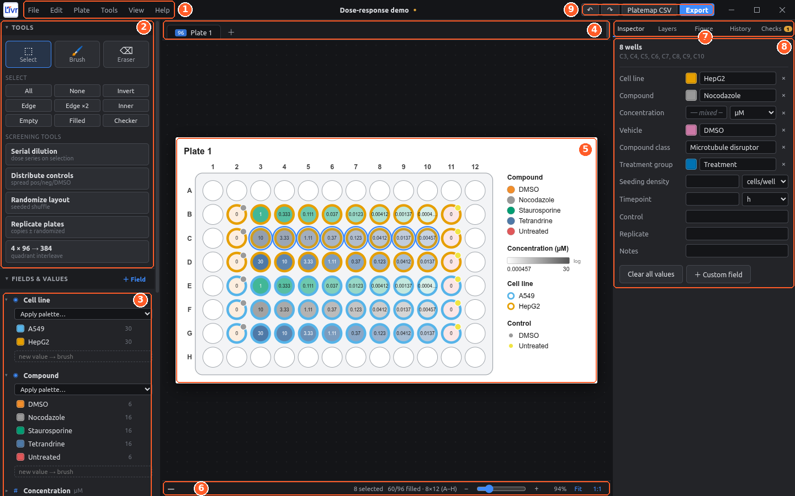
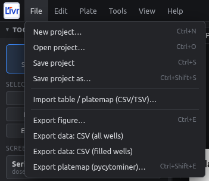
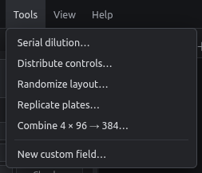
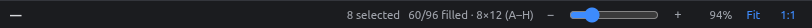

# The interface

<figure markdown="span">
  { .shot }
</figure>

1. **Menus:** File, Edit, Plate, Tools, View, Help.
2. **Tools:** Select, Brush and Eraser; quick selections (All, Edge, Inner, Empty, …); the screening wizards.
3. **Fields & values:** every field and the values used in it. Click a value to select its wells, 🖌 to paint with it, a swatch to recolor it.
4. **Plate tabs:** one tab per plate. Double-click a tab for its settings, right-click for more, **＋** to add a plate.
5. **Canvas:** the plate itself. Drag to select; zoom with ++ctrl++ + mouse wheel.
6. **Status bar:** the hovered well and its values, the selection count, and zoom controls (Fit, 1:1).
7. **Right-panel tabs:** Inspector, Layers, Figure, History, Checks. A badge shows how many checks need attention.
8. **Inspector:** edit the selected wells. Numbers have a unit dropdown.
9. **Quick actions:** Undo, Redo, **Platemap CSV** and **Export** (figure).

## Menus

<figure markdown="span">
  { .shot }
  <figcaption><b>File:</b> projects, import, all exports.</figcaption>
</figure>

<figure markdown="span">
  { .shot }
  <figcaption><b>Tools:</b> the screening wizards and new custom fields.</figcaption>
</figure>

## Left panel

<figure markdown="span">
  { .shot }
  <figcaption>Tools, quick selections and screening wizards.</figcaption>
</figure>

<figure markdown="span">
  { .shot }
  <figcaption>Fields and their values with counts for the current plate.</figcaption>
</figure>

## Right panel

| Tab | What it's for | Guide |
|---|---|---|
| **Inspector** | Edit values of the selected wells | [Entering values](../user-guide/editing-values.md) |
| **Layers** | Choose which field drives color, ring, badge, label… | [Layers](../user-guide/layers.md) |
| **Figure** | Well shape and size, fonts, legend, colors | [Figure style](../user-guide/figure-style.md) |
| **History** | Every edit; click to go back | [Undo & history](../user-guide/history.md) |
| **Checks** | Possible mistakes in the layout | [Checks](../user-guide/checks.md) |

## Status bar

{ .shot }

Hover any well to see all its values here. On the right: the number of selected wells, filled/total wells, and zoom controls. **Fit** sizes the plate to the window and **1:1** shows actual size.

## Resizing

- Drag the thin borders between the panels and the canvas to make the side panels wider or narrower.
- Zoom the canvas with ++ctrl++ + mouse wheel, the slider, or ++ctrl+equal++ / ++ctrl+minus++.
- Well size for figures is set separately in the [Figure tab](../user-guide/figure-style.md).
