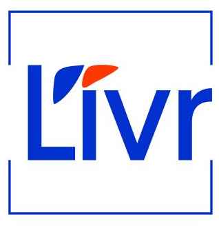
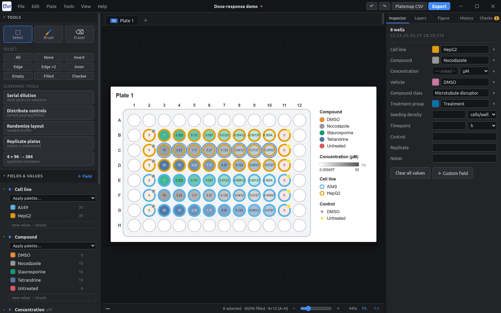
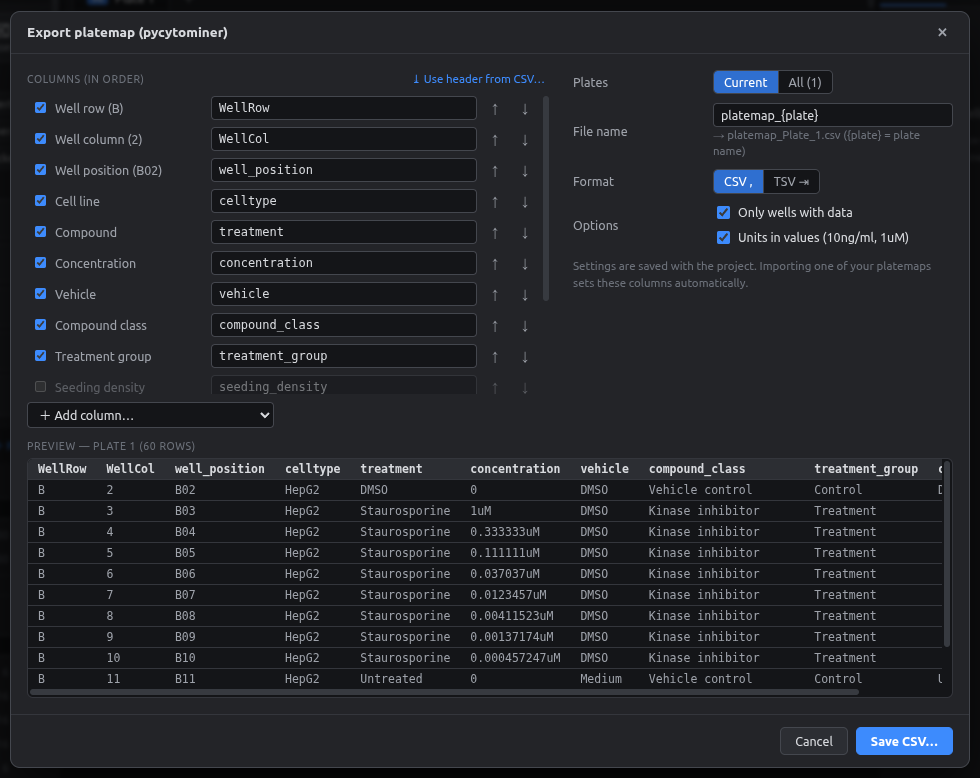

---
hide:
  - navigation
  - toc
---

{ width="84" .no-zoom }

# PlateMap Studio

A desktop plate-map designer for high-content screening and Cell Painting. You design the layout on the plate, can undo any edit, and export figures for papers and platemaps for pycytominer.

[:material-download: Download](https://github.com/LIVR-VUB/Platemap-studio/releases/latest){ .md-button .md-button--primary }
[:material-rocket-launch: Get started](getting-started/index.md){ .md-button }
[:material-book-open-variant: User guide](user-guide/index.md){ .md-button }

<figure markdown="span">
  { .shot }
  <figcaption>A 96-well dose-response layout with two cell lines, controls in columns 2 and 11, and concentrations printed in each well.</figcaption>
</figure>

## What it does

-   :material-grid:{ .lg .middle } **Any plate format**

    ---

    6, 12, 24, 48, 96, 384 and 1536 wells, or custom rows × columns. Several plates can live in one project.

    [:octicons-arrow-right-24: Plates & formats](user-guide/plates.md)

-   :material-undo-variant:{ .lg .middle } **Undo any edit**

    ---

    Unlimited undo and redo, plus a History panel that lets you jump back to any earlier step.

    [:octicons-arrow-right-24: Undo & history](user-guide/history.md)

-   :material-form-select:{ .lg .middle } **Your own metadata**

    ---

    Cell line, compound, concentration, vehicle and any custom field you need. Each value can have its own unit: nM, ng/ml, % v/v and more.

    [:octicons-arrow-right-24: Fields](user-guide/fields.md) · [Units](user-guide/units.md)

-   :material-palette:{ .lg .middle } **Clear figures**

    ---

    Layers show several fields at once. A Photoshop-style color picker and colorblind-safe palettes are built in.

    [:octicons-arrow-right-24: Layers](user-guide/layers.md)

-   :material-flask:{ .lg .middle } **Screening tools**

    ---

    Serial dilutions, evenly spread controls, layout randomization with a seed, replicate plates, and 4 × 96 → 384.

    [:octicons-arrow-right-24: Advanced tools](advanced/index.md)

-   :material-file-delimited:{ .lg .middle } **Ready for pycytominer**

    ---

    Exports platemaps with your exact column names, one file per plate, plus `barcode_platemap.csv`. Vehicle and compound class fill in automatically.

    [:octicons-arrow-right-24: Platemap export](advanced/platemap-export.md)

## See it in action

<figure markdown="span">
  { .shot }
  <figcaption>Figure export: vector PDF/SVG or high-DPI PNG.</figcaption>
</figure>

<figure markdown="span">
  { .shot }
  <figcaption>pycytominer platemap export with a live preview.</figcaption>
</figure>

<figure markdown="span">
  { .shot }
  <figcaption>A 384-well Cell Painting layout with controls spread across the plate.</figcaption>
</figure>

<figure markdown="span">
  { .shot }
  <figcaption>The serial dilution wizard previews the series before applying it.</figcaption>
</figure>

## Runs on

| :fontawesome-brands-windows: Windows 10/11 | :fontawesome-brands-apple: macOS (Apple Silicon & Intel) | :fontawesome-brands-linux: Linux (Ubuntu, Debian, AppImage) |
|:---:|:---:|:---:|
| [Installer or portable `.exe`](getting-started/installation.md#windows) | [`.dmg`](getting-started/installation.md#macos) | [`.deb` or `.AppImage`](getting-started/installation.md#linux) |
