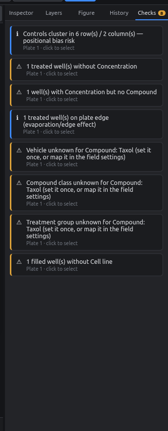

# Checks

The **Checks** tab looks for likely mistakes as you work. The badge on the tab shows how many it found.

<figure markdown="span">
  { .shot width="320" }
</figure>

**Click an issue** to switch to its plate and select the wells involved.

| Check | Level | Why it matters |
|---|---|---|
| Duplicate plate name | ⛔ error | Platemap file names would collide |
| No control wells on a plate | ⚠ warning | Per-plate normalization needs controls |
| Treated well without a concentration | ⚠ warning | Incomplete metadata |
| Concentration without a compound | ⚠ warning | Usually a leftover value |
| Filled well without a cell line | ⚠ warning | When any well on the plate has one |
| *Vehicle / class / group* unknown for a compound | ⚠ warning | Auto-fill has no mapping yet for that compound |
| Controls clustered in a few rows/columns | ℹ info | Risk of positional bias |
| Controls or treatments on edge wells | ℹ info | Edge wells evaporate faster |

!!! note "What counts as a control"
    A well counts as a control if the **Control** field is set, or if any field has the value **Control**. This covers `treatment_group = Control` style platemaps.

The checks never block you; they're reminders. An empty list shows a green ✓.
