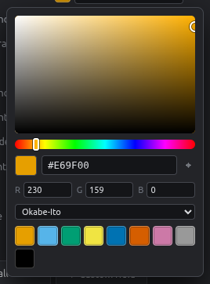

# Colors

Every category value (each compound, cell line, control type…) has its own color. New values get a colorblind-safe color that isn't already used by another field.

## Color picker

Click any color swatch in the Fields panel, the Inspector, the Layers tab or the Figure tab.

<figure markdown="span">
  { .shot width="280" }
</figure>

- **Square:** saturation and brightness. **Bar:** hue.
- **Hex box:** paste a color like `#0072B2`.
- **R G B:** exact values.
- **⌖ Eyedropper:** pick any color from your screen, e.g. from a journal figure.
- **Recent:** the colors you used last.
- **Palettes:** Okabe-Ito, Tol Bright, Tol Muted, Tableau, Pastel, Bold, Set3.

Dragging in the picker updates the plate live, and the whole adjustment is a single undo step.

## Recolor a whole field

In **Fields & values**, use **Apply palette…** under a category field to recolor all its values in one step.

| Palette | Good for |
|---|---|
| **Okabe-Ito** | Default. Safe for every type of color blindness |
| **Tol Bright / Tol Muted** | Publication figures, colorblind-safe |
| **Tableau** | Many categories (10 colors) |
| **Pastel** | Light fills under dark text |
| **Set3** | Up to 12 categories |

## Number gradients

Number fields use **color ramps** (Viridis, Magma, Cividis, Blues, Reds, Greys, Blue–Red) instead of fixed colors. You choose these in the [Layers](layers.md) tab.
