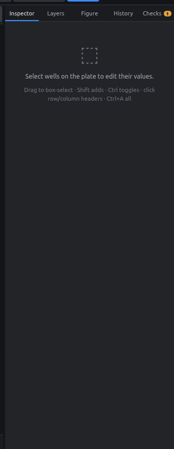
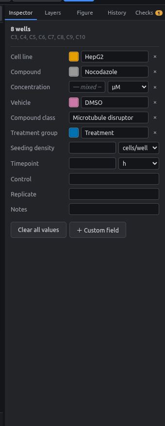
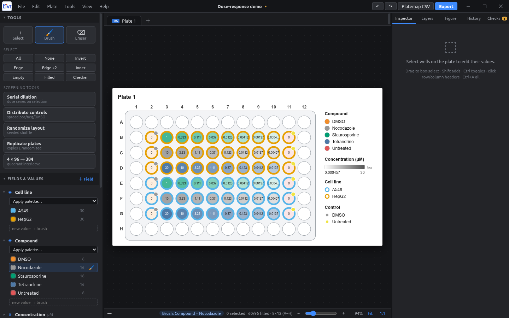

# Entering values

There are three ways to put values into wells.

## 1. The Inspector

Select wells, then type in the **Inspector** (right panel) and press ++enter++.

<figure markdown="span">
  { .shot }
  <figcaption>Nothing selected yet.</figcaption>
</figure>

<figure markdown="span">
  { .shot }
  <figcaption>8 wells selected. Fields that differ between them show <i>— mixed —</i>.</figcaption>
</figure>

- **Category fields** (cell line, compound, …) suggest values you've used before as you type. The color swatch next to the box recolors that value everywhere.
- **Number fields** have a **unit dropdown** next to the box. Pick nM, µM, ng/ml, … or type the unit with the number (`10 ng/ml`). See [Units](units.md).
- **×** clears that field for the selected wells.
- **Clear all values** empties the selected wells completely.
- **＋ Custom field** adds a new field. See [Fields](fields.md).

{ .shot }

!!! tip "Mixed values are safe"
    If the selected wells differ, the box shows *— mixed —*. Nothing changes unless you type something.

## 2. Brush

The brush paints one value onto every well you drag over.

1. In **Fields & values**, click **🖌** next to a value. To paint a new value, type it in the dashed **new value → brush** box. Number fields have a unit dropdown there too.
2. Drag over wells. The whole stroke becomes one undo step.
3. Press ++v++ to go back to selecting.

<figure markdown="span">
  { .shot }
  <figcaption>Brush mode: the value being painted is highlighted in the Fields panel and shown in the status bar ("Brush: Compound = Nocodazole").</figcaption>
</figure>

## 3. Copy & paste

1. Select wells and press ++ctrl+c++.
2. Select the top-left well of the destination and press ++ctrl+v++.

The pasted block keeps its shape, so a 3 × 8 block pastes as 3 × 8. It also works between plates.

## Eraser and clearing

- **Eraser** (++e++): drag over wells to empty them.
- ++delete++: empties the selected wells.
- **×** in the Inspector: clears one field only.

Every one of these can be undone with ++ctrl+z++.
