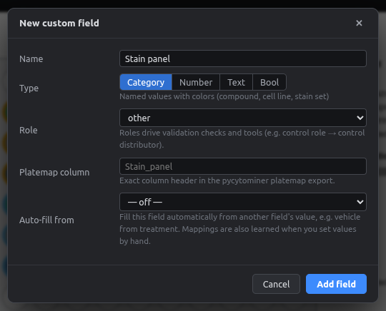
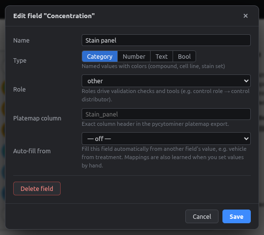
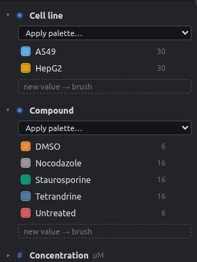

# Fields

A **field** is one piece of information about a well: its cell line, compound, concentration, and so on. Each field becomes a column in the exports.

## Built-in fields

| Field | Type | Platemap column | Notes |
|---|---|---|---|
| Cell line | category | `celltype` | |
| Compound | category | `treatment` | |
| Concentration | number (µM default) | `concentration` | per-well units |
| Vehicle | category | `vehicle` | [auto-fills](../advanced/auto-fill.md) from Compound |
| Compound class | text | `compound_class` | auto-fills from Compound |
| Treatment group | category | `treatment_group` | auto-fills from Compound |
| Seeding density | number (cells/well) | `seeding_density` | |
| Timepoint | number (h) | `timepoint` | |
| Control | category | `control_type` | Positive / Negative / DMSO / Untreated / Empty |
| Replicate | text | `replicate` | |
| Notes | text | `notes` | |

## Field types

| Type | Use it for | Example |
|---|---|---|
| **category** | Named values with a color each | compound, cell line, stain panel |
| **number** | Numbers with a unit; can be shown as a color gradient | concentration, density, timepoint |
| **text** | Free text without colors | notes, IDs, compound class |
| **bool** | Yes/no flags | excluded, transfected |

## Adding a custom field

Click **＋ Field** in the left panel, **＋ Custom field** in the Inspector, or **Tools → New custom field…**.

<figure markdown="span">
  { .shot width="560" }
</figure>

- **Name:** as shown in the app.
- **Type:** see the table above.
- **Default unit** (numbers only): pick from the dropdown or type your own. See [Units](units.md).
- **Role:** tells the app what the field means, which drives the [checks](checks.md) and tools. For example, the *control* role marks which wells are controls.
- **Platemap column:** the exact column header in the [pycytominer export](../advanced/platemap-export.md).
- **Auto-fill from:** fill this field automatically from another one. See [Auto-fill fields](../advanced/auto-fill.md).

<figure markdown="span">
  { .shot width="560" }
  <figcaption>Settings of a number field: the default unit can be picked or typed.</figcaption>
</figure>

## Editing and deleting fields

Click ⚙ next to a field in **Fields & values** to change its name, type, unit, role, export column or auto-fill. **Delete field** removes the field and all its values, and can be undone.

- **Changing the type:** existing values are converted where possible (e.g. `"10"` → `10`).
- **Changing the default unit:** existing numbers keep their meaning. See [Units](units.md#changing-the-default-unit).

## Values in the Fields panel

<figure markdown="span">
  { .shot width="300" }
</figure>

- **Click** a value to select its wells on the current plate.
- **Double-click** to rename it **everywhere**. For numbers this can also change the unit, e.g. `10 µM` → `10 nM`.
- **🖌** paints with that value.
- **The swatch** changes its color.
- **Apply palette…** recolors all values of the field at once.
- The number on the right counts wells on the current plate.
- **↑** moves a field up. Field order is also the default column order in exports.
