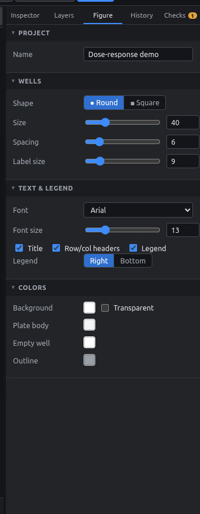
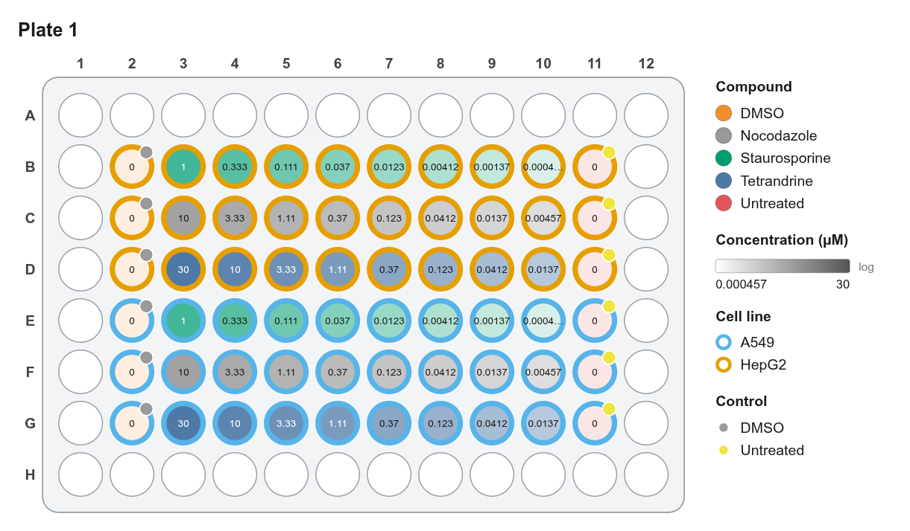
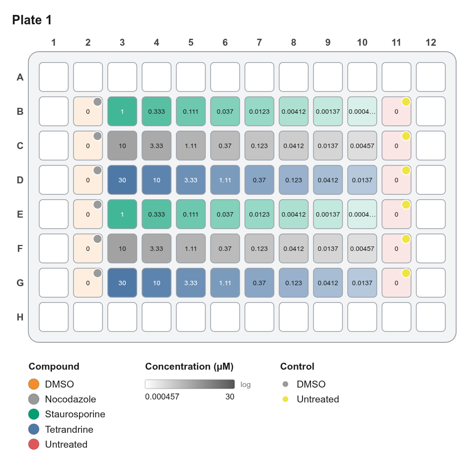

# Figure style

The **Figure** tab controls how the plate looks, both on screen and in every export.

<figure markdown="span">
  { .shot width="320" }
</figure>

| Section | Options |
|---|---|
| **Project** | Experiment name (shown in the title bar and used for export file names) |
| **Wells** | Shape (round / square), size, spacing, label size |
| **Text & legend** | Font, font size, show title / row & column headers / legend, legend on the right or at the bottom |
| **Colors** | Background (or transparent), plate body, empty well, outline |

Dragging a slider merges into one undo step, so the History isn't flooded.

<figure markdown="span">
  { .shot }
  <figcaption>Round wells, legend on the right.</figcaption>
</figure>

<figure markdown="span">
  { .shot }
  <figcaption>Square wells, legend at the bottom, ring layer off.</figcaption>
</figure>

!!! tip "Tips for publication figures"
    - Use **Arial** or **Helvetica**; most journals ask for these.
    - Set the font size to 8–10 pt *at the final print size*. Export SVG or PDF and scale in Illustrator or Inkscape if needed.
    - Turn on **Transparent** background for PNGs placed on colored slides.
    - Square wells pack tighter for 384- and 1536-well plates.

**Zoom** (status bar) only changes the view on screen. **Well size** changes the actual figure.
