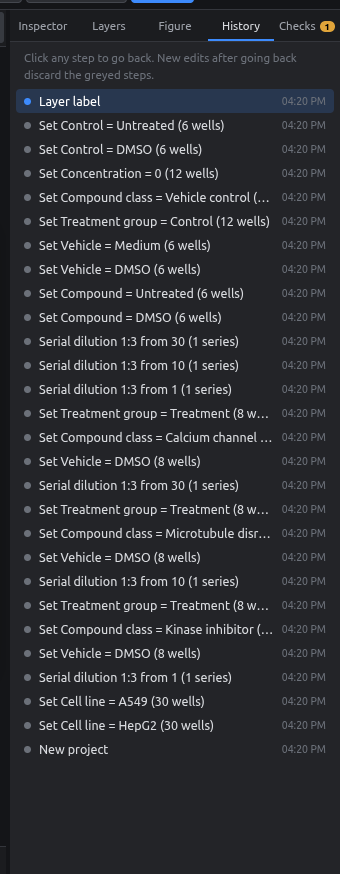

# Undo & history

Every change you make is saved as a step: entering values, dilutions, randomizing, recoloring, renaming, deleting plates. You can always go back.

## Undo and redo

| Keys | Action |
|---|---|
| ++ctrl+z++ | Undo |
| ++ctrl+shift+z++ or ++ctrl+y++ | Redo |

The **↶ ↷** buttons in the title bar do the same.

## The History panel

<figure markdown="span">
  { .shot width="320" }
</figure>

- The newest step is at the top, each with a description and a time.
- **Click any step** to jump back to that state. The steps after it turn grey.
- Making a new edit after jumping back discards the grey steps, as in Photoshop.
- Seeds used for randomization are recorded in the step name (e.g. *Randomize 60 wells (seed 123)*), so you can always see how a layout was made.

!!! info "How far back?"
    The last 300 steps are kept. Saving a project stores its current state, not the history.

## Mistakes that are easy to undo

- Deleting a field or a plate.
- Shrinking a plate format, which removes wells that no longer fit.
- Importing the wrong file.
- Applying a palette.
- Overwriting a whole column of values.
