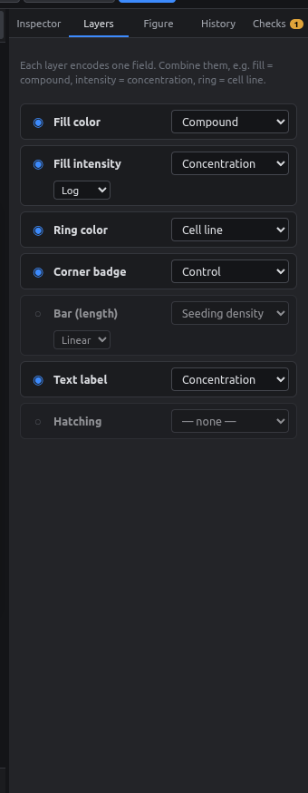
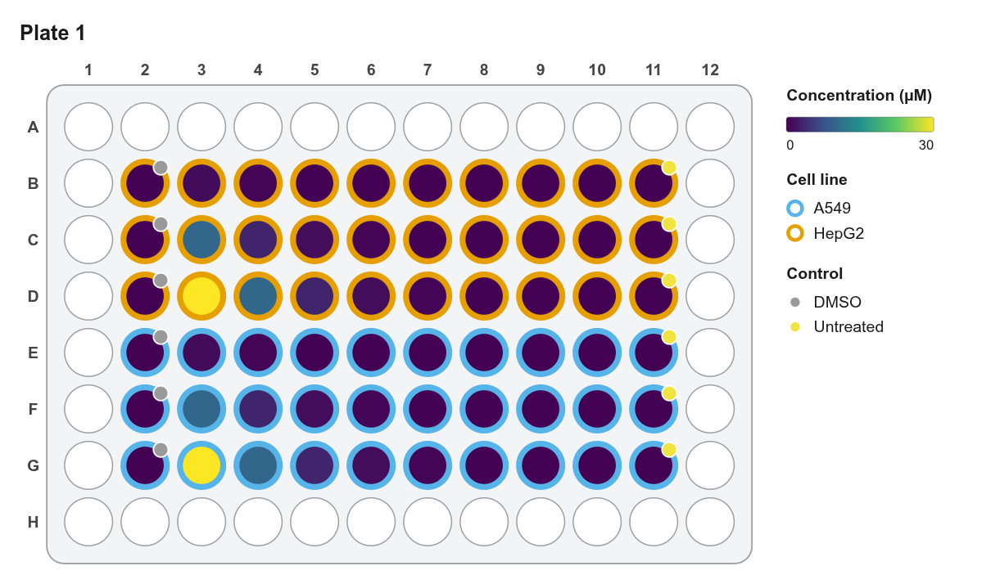

# Layers

Each well can show several fields at once. Every part of the well is a **layer**, and each layer is driven by one field.

<figure markdown="span">
  { .shot width="320" }
</figure>

| Layer | What it draws | Typical field |
|---|---|---|
| **Fill color** | The well's main color | Compound |
| **Fill intensity** | Lighter/darker version of the fill | Concentration (log) |
| **Ring color** | A colored ring around the well | Cell line |
| **Corner badge** | A small dot at the top-right | Control type |
| **Bar (length)** | A small bar whose length is the value | Seeding density |
| **Text label** | The value printed in the well | Concentration |
| **Hatching** | Diagonal stripes | An "excluded" yes/no field |

For each layer:

- **◉ / ○** turns the layer on or off.
- **Dropdown** picks the field it shows.
- For number fields: **Linear / Log** scale. Use log for dilution series.
- For number fields: **Ramp…** presets and editable color stops.

## Examples

<figure markdown="span">
  { .shot }
  <figcaption>Fill = compound, intensity = concentration (log), ring = cell line, badge = control, label = concentration.</figcaption>
</figure>

<figure markdown="span">
  { .shot }
  <figcaption>Fill = concentration with the Viridis ramp (log); ring = cell line.</figcaption>
</figure>

!!! tip "Keep figures readable"
    Three or four layers is usually the limit before a figure gets busy. Turn layers off for slides and keep them for supplementary figures.

The legend updates automatically and only lists values used on that plate.
