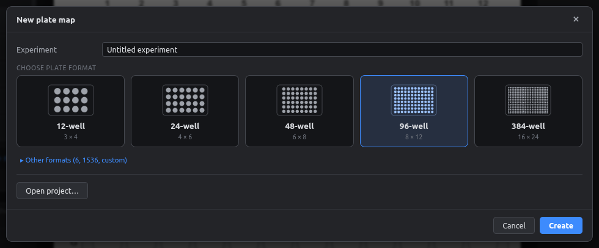
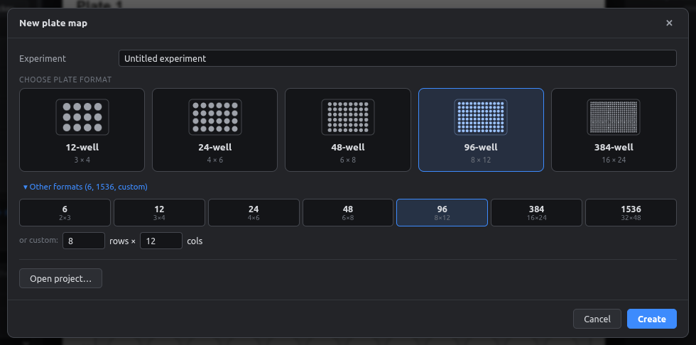
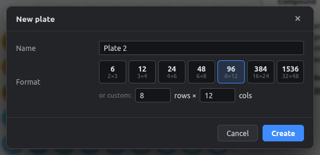
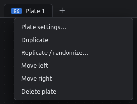
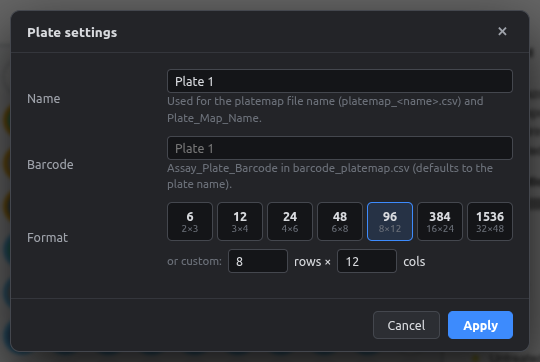

# Plates & formats

## Supported formats

| Format | Layout | Rows |
|---|---|---|
| 6-well | 2 × 3 | A–B |
| 12-well | 3 × 4 | A–C |
| 24-well | 4 × 6 | A–D |
| 48-well | 6 × 8 | A–F |
| 96-well | 8 × 12 | A–H |
| 384-well | 16 × 24 | A–P |
| 1536-well | 32 × 48 | A–AF |
| Custom | any rows × columns | |

You pick the format on the start screen. Click **Other formats** there for 6-well, 1536-well or a custom size.

<figure markdown="span">
  { .shot }
</figure>

<figure markdown="span">
  { .shot }
</figure>

## Several plates in one project

Each plate gets a tab above the canvas. The badge on the tab shows the well count.

{ .shot }

| To… | Do this |
|---|---|
| Add a plate | Click **＋** next to the tabs, or **Plate → New plate…** |
| Switch plate | Click its tab |
| Rename, change format, set barcode | Double-click the tab (**Plate settings**) |
| Duplicate, reorder, delete | Right-click the tab |

<figure markdown="span">
  { .shot }
  <figcaption>New plate: name and format.</figcaption>
</figure>

<figure markdown="span">
  { .shot width="260" }
  <figcaption>Right-click a tab.</figcaption>
</figure>

## Plate settings

<figure markdown="span">
  { .shot width="560" }
</figure>

- **Name:** shown as the figure title and used for the platemap file name (`platemap_<name>.csv`).
- **Barcode:** written as `Assay_Plate_Barcode` in `barcode_platemap.csv`. If left empty, the plate name is used.
- **Format:** changing it keeps every well that still fits. If wells would be removed, the dialog warns you first, and you can always undo.

!!! note "Fields and layers are shared"
    All plates use the same fields, colors and layers, so a compound has the same color on every plate. Well values are per plate.
