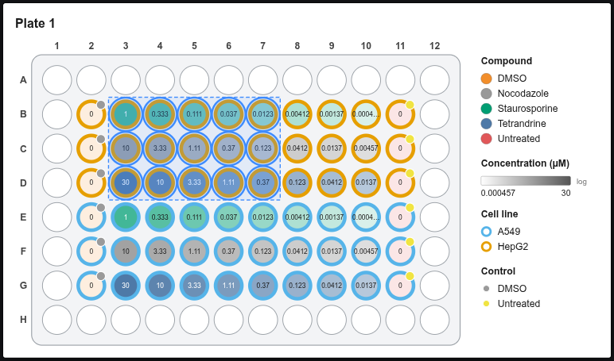
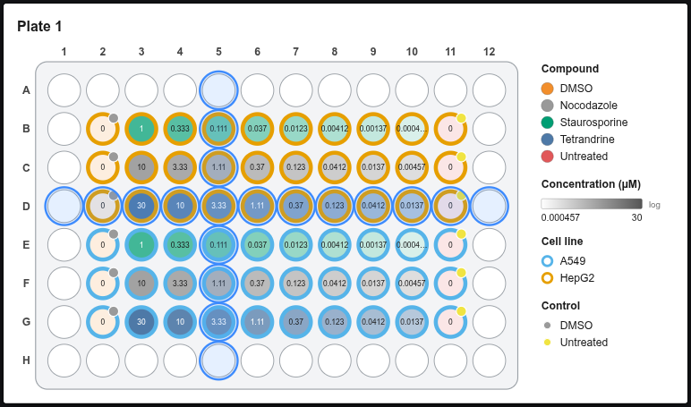
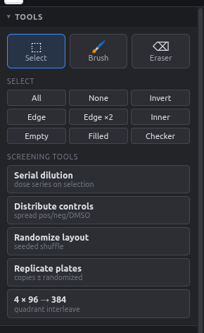
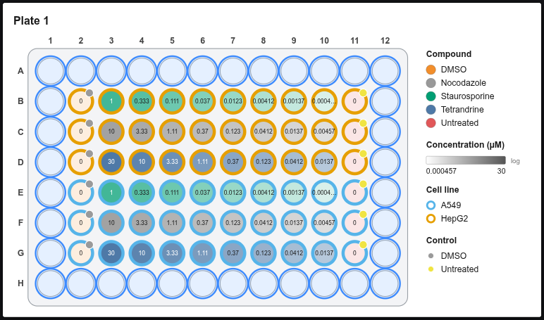

# Selecting wells

Almost everything works on the **selected wells**: entering values, dilutions, randomizing, clearing. Selected wells have a blue outline.

## With the mouse

| Action | Result |
|---|---|
| Click a well | Select just that well |
| Drag from one well to another | Box-select the rectangle |
| ++shift++ + click / drag | Add to the selection |
| ++ctrl++ + click / drag (++cmd++ on Mac) | Toggle wells in or out |
| Click a **row letter** (A, B, …) | Select the whole row; drag over letters for several rows |
| Click a **column number** | Select the whole column |
| Click the top-left corner | Select every well |
| Click empty canvas | Clear the selection |

<figure markdown="span">
  { .shot }
  <figcaption>Dragging from B3 to D7.</figcaption>
</figure>

<figure markdown="span">
  { .shot }
  <figcaption>Row D plus column 5 (header clicks with ++shift++).</figcaption>
</figure>

## Quick selections

The **Select** buttons in the left panel:

{ .shot width="290" align=right }

- **All / None / Invert**
- **Edge:** the outer ring of wells, which is prone to evaporation
- **Edge ×2:** the outer two rings
- **Inner:** everything except the edge
- **Empty / Filled:** wells without or with any value
- **Checker:** a checkerboard pattern

Combine them: for example, click **Inner** and then **Invert** to get the edge.

<figure markdown="span">
  { .shot width="680" }
  <figcaption><b>Edge</b> selects the outer ring, often used for buffer or blank wells.</figcaption>
</figure>

## Select by value

In **Fields & values** (left panel), **click a value** to select every well that has it. ++shift++-click adds to the selection.

## Keyboard

| Keys | Action |
|---|---|
| ++ctrl+a++ | Select all |
| ++ctrl+d++ or ++esc++ | Deselect |
| ++delete++ | Clear the selected wells |
