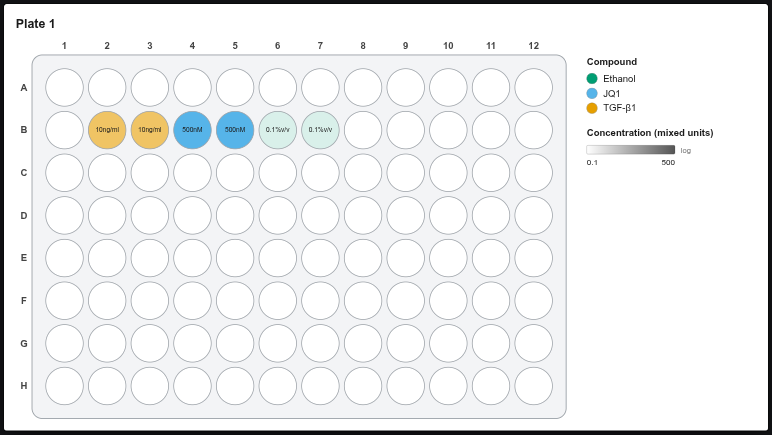
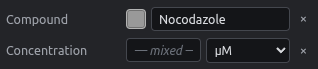
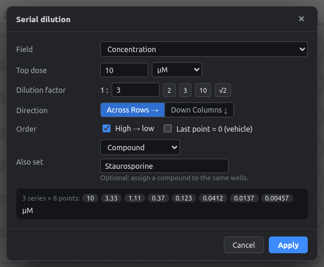
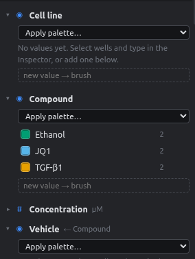

# Units

Every number can have its own unit, and one plate can mix them. For example, TGF-β1 at **10 ng/ml**, JQ1 at **500 nM** and ethanol at **0.1 % v/v**.

<figure markdown="span">
  { .shot width="720" }
  <figcaption>Wells whose unit differs from the field default show it in the label. The legend says "mixed units".</figcaption>
</figure>

## Available units

| Kind | Units |
|---|---|
| Molar | fM, pM, nM, µM, mM, M |
| Mass / volume | pg/ml, ng/ml, µg/ml, mg/ml, g/l |
| Percent & parts | %, % v/v, % w/v, ppm, ppb |
| Activity & other | U/ml, IU/ml, x (fold), MOI |
| Cells | cells/well, cells/ml, cells/cm² |
| Time | s, min, h, d |
| Volume | nl, µl, ml |

You can also **type any other unit**, e.g. `10 mg/kg`. Typed units are kept exactly as written.

## Setting units

=== "Inspector"

    Type the number, then pick the unit from the dropdown next to it. You can also type them together: `10 nM`, `10nM` and `0.5 µg/ml` all work.

    { .shot }

    Changing only the dropdown changes the unit of the selected wells and leaves the numbers alone.

=== "Serial dilution"

    The **Top dose** has its own unit dropdown. The whole series uses that unit.

    { .shot width="520" }

=== "Brush"

    The **new value → brush** box in the Fields panel has a unit dropdown. Brushing paints the number together with its unit.

=== "Fields panel"

    Numbers are listed per value **and** unit, so `10 nM` and `10 ng/ml` appear separately. Double-click one to change it everywhere, e.g. to `20 µg/ml`.

    { .shot width="300" }

## Changing the default unit

Each number field has a **default unit** (Concentration: µM), set in the field settings (⚙). Wells without their own unit use the default.

!!! success "Changing the default never changes your data"
    If you switch Concentration from µM to nM, wells that were **3 µM stay 3 µM**: they get µM as their own unit. Wells already in nM simply follow the new default.

## Units in exports

| Export | How units appear |
|---|---|
| Platemap CSV | Inside the value: `10nM`, `10ng/ml`, `0.1%v/v`, and plain `0` for vehicle. µ is written as `u` (`1uM`). This can be switched off. |
| Data CSV | The header carries the default unit (`Concentration (µM)`). Values with a different unit include it. |
| Figure | Well labels show the unit when it differs from the default; the legend title shows the unit or "mixed units". |

!!! warning "Color scaling with mixed units"
    The fill-intensity and color-ramp layers scale on the raw numbers. On a plate that mixes nM and ng/ml, compare shades only within one unit.
